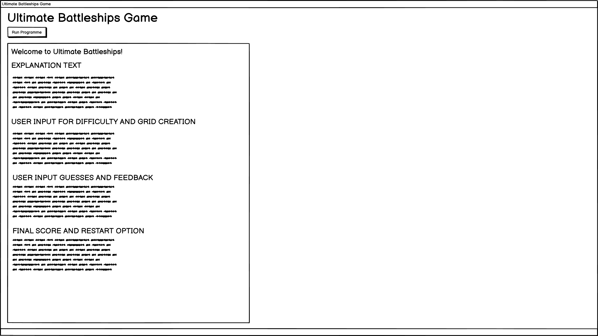

# Ultimate Battleships

**Ultimate Battleshis** is a Command Line Interface (CLI) game. The aim of this CLI is to provide users with a way of practicing a game of Battleships, which is a game that requires outwitting your opponent.

## User Stories & Wireframes

### User Stories

The decision to make this website is due to the user stories found [here](userstory.md).

### Wireframes

From the user stories you can see the wireframes that were mocked up below.

### Logic Flow Chart

From the User Stories and wireframes a logic flow chart was mocked up to help know what the code needs to do, e.g. where error messages need to be, where loops need to be, when to end the program, etc. You can see the flow chart below.

## Responsive Design

## Features

Below are the features for the website and at the end is listed any features that weren't able to be implemented but would be with more time.

### Existing Features

#### Username Creation

- When 

### Features Left to Implement

- Create

## Testing

The 

### Fixed Bugs

- aksjhdfga

### Unfixed Bugs

- None

### Links and Actions

| Location | Link / Button | Expected Action | Pass / Fail |
| ----- | ----- | ----- | ----- |
| Username Creation | Username not entered | Tell user to fill in the field | Pass |

### Validator Testing

- PEP8

## Creating the Heroku app
To create the app Heroku was used. In Heroku two buildpacks were needed and were accessed from the _Settings_ tab in Heroku. After adding the individual buildpacks the settings were saved. The two packs used and their ordering is as follows:

1. `heroku/python`
2. `heroku/nodejs`

Then X config vars were needed and were created by going to _Settings_ tab in Heroku and scrolling down to _Config Var_ section. After each individual config var was added the settings were saved Then the following config vars were created: 

1. One called `PORT` and set to `8000` was created
2. 

Then the GitHub repository was connected by following the below steps:

1. Go to _Deploy_ section
2. Select GitHub as the deployment method
3. Confirm we wanted to connect GitHub
4. Then search for the ultimate_battleships repository and connected it
5. Then Enable Automatic Deploys for the main branch was selected to ensure all changes to the code were deployed to the app

Please note that you can choose to manually deploy the branch you want from the repository

## Cloning

This section describes how other software developers can clone the code to edit it elsewhere

- To clone the code so you can edit it yourself please follow the below:
  PLEASE NOTE THIS IS FOR WINDOWS COMMAND LINE
  - In the GitHub repository click the dropdown for '<> code'
  - Ensure you are on 'local' and have 'https' selected, then copy the URL by clicking the symbol next to the URL box
  - Once copied in the search bar on your taskbar type in 'cmd' and open 'Command Prompt' or 'Comman Line'
  - In command line type 'git clone' and paste the url next to it
  - In file explorer locate 'This PC' down the side, then 'local disk' (usually the :C drive), then 'users', then your user, then find the folder called 'photo-guides'
  - You now have access to all the code and files locally
  - If you want to edit the code, please ensure you creat a new branch in the software you are using enabling us to potentially see the edits you have done before uploading them to the original GitHub repository
  - To create a new branch that depends on the software you are using, please google how to do this for your software

If you aren't on windows please google how to get a GitHub repository stored locally on your OS

## Credits

Below are my credits for where I got inspiration for some of the code.

### Code

- The
