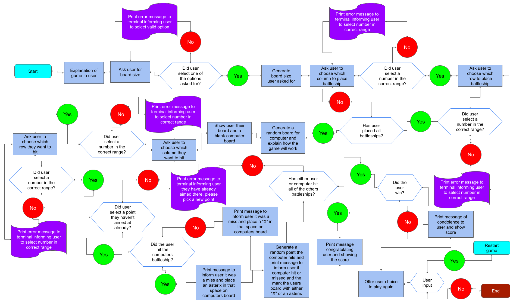

# Ultimate Battleships

**Ultimate Battleshis** is a Command Line Interface (CLI) game. The aim of this CLI is to provide users with a way of practicing a game of Battleships, which is a game that requires outwitting your opponent.

## User Stories & Wireframes

### User Stories

The decision to make this website is due to the user stories found [here](userstory.md).

### Logic Flow Chart

From the User Stories and wireframes a logic flow chart was mocked up to help know what the code needs to do, e.g. where error messages need to be, where loops need to be, when to end the program, etc. You can see the flow chart below.

Please note that in features and testing there are extra parts to the logic flow, which were thought of later in the project.

## Responsive Design

## Features

Below are the features for the website and at the end is listed any features that weren't able to be implemented but would be with more time.

### Existing Features

#### Username Creation

- When 

### Features Left to Implement

- Create

## Testing

The 

### Fixed Bugs

- In user_create the password and username weren't being stored in Google Sheets properly as there was no return within username_create and password_create
- Username creation was duplicating usernames in database due to structure of if, elif check_username function, therefore restuctured to put the check for username already in database first
- Board Creation was creating grid was to be 2D due to use of rows and cols, so coordinates were not being processed correctly, therefore changed the code to ensure the grid was being created as a 3D to allow proper use of coordinate selection
- When user input coordinates for ship placement they had placed in already it wasn't looping back to ask for the coordinates again, added in if, elif statement to ensured it looped properly
- When user input coordinates to shoot at have alreday been chosen it also wasn't looping, to loop had to amend the True and False returns in update_board
- Command line was running too fast so hard to read. Therefore, used time module to allow slower processing of the print statements
- After each shot the program is adding a hit to the user_ships_hits and computer_ships_hit if a ship has been hit previously, added ships_hit to update_board function and added code to play_game function to check for any "H" on the board
- Updated boards weren't printing to the terminal at all, updated play_game function to display_board in the correct space to allow it to be displayed
- Update_board function printing the statement incorrectly when a ship is hit, needed to reorder the structure below the elif statements
- Username not accessed by other scripts:
  - Username being fetched from database, the user_choice function keeps being called everytime fetch_username is being called, therefore set the username input as a global variable and created a function in user.py that returned the username which was then imported into game_logic.py
  - The above fix is not best practice, therefore adjusted user_login, user_creation and user_choice to properly return the correct information to allow the username to be accessed by other scripts
  - To also double check the login_credentials there was a while loop added to the main function in main.py to check that the username had returned properly
- Game state not saving when user requests to save it due to board not being JSON serializable, add function that converts the table into a string that is readable for google sheets
- Game did not exit after user input's save option, sys.exit was missing () at the end
- Unable to load previous game due to type error in board_size function, had to amend what was imported from battleships.py in main.py to allow use of Board class properly so the type could be located properly
- When logging in with a user that had no saved games it was still asking for user input to see if they wanted to load any saved games, had to create an instance of Load_Games as a variable and then call load_saved_games before the if, while and else statement, this then means if no saved game can be located with that username we go to play_game instead, if there is a saved game it asks if they want to load a saved game or not
- Password check function was misreading the re.search special character list, due to the positioning of symbols, had to reorder the symbols to ensure python read it correctly.
- Loaded in board was not looking user friendly, so used the " ".join to help make the board display nicely when loaded in.
- Leaderboard was displaying without a title or headings, so I added a leaders variable to lb_order that was appended too throughout to make the code neater and more manageable to read.
- When asking user to decide if they wanted to save, continue or exit the program and the user made an invalid input it kept looping through the print statement becuase the input request wasn't in the while loop
- Save function wasn't saving ship placement by the computer, so added a "," to ensure each item is saved to show the board as a list of strings, the user does not have access to the database file.
- When loading the saved game the boards weren't being converted as I needed to add the "," to the convert_board_to_grid function as the saved board was a list of strings
- When loading saved game states the program was displaying the ship placement, therefore needed to use the display_board function with the show_ships parameter correctly for the user board and computer board
- The computer's random shots sometimes shoot at the space it has already shot at to avoid this I added some variables to track and store where the computer had shot, so the random selection was not a duplicate shot.
- After adding colorama to various parts of the card we had some bugs:
  - dispaly_board function wouldn't work as the colour match wouldn't work. So had to change it from a hard equals to just look for an S no matter the colour.
  - update_game_status was printing the players name for both, because of a mistyped line by myself, fixed by changing it from {player} to Computer.
  - the save_game_state function wasn't accepting the inputs properly moved play_game function into game_logic.py at the end of the Game class, then renamed play_game function to full_game in main.py call the play_game function from game_logic.py
  - When checking shots due to the S and H now having a colour it the update_board function wasn't working out when a user or the computer hit a ship, so added in the colours to the if and elif statements.
  - The saved board was including the colorama ANSI codes in the saved boards, to remove this I added remove_colorama_codes() which compiles the various characters and numbers used in the ANSI codes and then removes them from the board before saving.
- No size set in full_game function for leaderboard_generation function to be called, therefore, added a size=None parameter in the full_game function.
- After cleaning up the code in the Game class and in main.py user_board and computer_board were accessing functions the wrong way, leading to not asking the user to place the ships and having blank boards. To fix the issue the requirement was to use self.player_board and self.pc_board variables in them instead of calling Board class.
- The user_hits and computer_hits in full_game and new_game were set to None rather than 0 as an integer.
- Saved data wasn't saving number of ships correctly due to passing None as the attribute and not 0 as a integer and ensure the num_ships was being used in the update and append_row part of the save_game_state function
- new_game function wasn't collecting the number of ships from selected game correctly, added total_ships=user.num_ships to the parameters of full_game within new_game.
- Validating password creation was not allowing passwords that were 8 characters long due to the >= 8, so removed the = signs from that if statement
- The available coordinates for the computer random shots wasn't resetting correctly, changed the if statement to have if not self.available_coordinates instead of if self.available_coordinates None
- Loaded games not listed correctly to choose from, had to ensure the games were being listed correctly by adding , _ to the self_games variable in access_saved_games to enable it to have the two parameters listed, but the second we did not care about
- Due to calling the wrong function from style.py the computer board wasn't placing ships properly, updated the function from style.py to be correct
- User hits and computer hits were being increased to the total number of ships due to an unneeded variable that changed the hits incorrectly player turn and computer turn

### Unfixed Bugs

- None

### Logic Flow Table

I have made a logic flow table to monitor the testing of the features.
Due to the loops depending on the user input the steps can be labelled with an A, B, C, etc to indicate which step it has moved too.

You can access it [here](logicflow.md)

### Validator Testing

- PEP8

## Creating the Heroku app
To create the app Heroku was used. In Heroku two buildpacks were needed and were accessed from the _Settings_ tab in Heroku. After adding the individual buildpacks the settings were saved. The two packs used and their ordering is as follows:

1. `heroku/python`
2. `heroku/nodejs`

Then 2 config vars were needed and were created by going to _Settings_ tab in Heroku and scrolling down to _Config Var_ section. After each individual config var was added the settings were saved Then the following config vars were created: 

1. One called `PORT` and set to `8000` was created
2. creds.json

Then the GitHub repository was connected by following the below steps:

1. Go to _Deploy_ section
2. Select GitHub as the deployment method
3. Confirm we wanted to connect GitHub
4. Then search for the ultimate_battleships repository and connected it
5. Then Enable Automatic Deploys for the main branch was selected to ensure all changes to the code were deployed to the app

Please note that you can choose to manually deploy the branch you want from the repository

## Cloning

This section describes how other software developers can clone the code to edit it elsewhere

- To clone the code so you can edit it yourself please follow the below:
  PLEASE NOTE THIS IS FOR WINDOWS COMMAND LINE
  - In the GitHub repository click the dropdown for '<> code'
  - Ensure you are on 'local' and have 'https' selected, then copy the URL by clicking the symbol next to the URL box
  - Once copied in the search bar on your taskbar type in 'cmd' and open 'Command Prompt' or 'Comman Line'
  - In command line type 'git clone' and paste the url next to it
  - In file explorer locate 'This PC' down the side, then 'local disk' (usually the :C drive), then 'users', then your user, then find the folder called 'photo-guides'
  - You now have access to all the code and files locally
  - If you want to edit the code, please ensure you creat a new branch in the software you are using enabling us to potentially see the edits you have done before uploading them to the original GitHub repository
  - To create a new branch that depends on the software you are using, please google how to do this for your software

If you aren't on windows please google how to get a GitHub repository stored locally on your OS

## Credits

Below are my credits for where I got inspiration for some of the code.

### Code

- This video helped me understand regex, [regex tutorial](https://www.youtube.com/watch?v=F6FW_NMtvNY)
- This article helped me understand how to import other script files as modules, [import python script as a module guide](https://csatlas.com/python-import-file-module/)
- This video helped me understand how to use user login verification and creation in python, [User Login Guide in Python](https://www.youtube.com/watch?v=9OjD_HjV03E)
- Below are the various articles I used to help form the battleships game:
  - [Battleship Game Guide 1](https://bigmonty12.github.io/battleship)
  - [Battleship Game Guide 2](https://www.pyshine.com/Make-a-battleship-game/)
  - [Battleship Game Guide 3](https://llego.dev/posts/how-code-simple-battleship-game-python/)
- Using the Love Sandwiches project I learnt how to use Google APIs and therefore used the steps to be able to use Google Sheets as my database
- Code Institutes Battleships example introduced me to random and randint
- Various stack overflow posts introduced me to sys and time module and how to use them both, there were too many to remember which ones were truly helpful
- My mentor mentioned to me about colorama module and this video helped me understand it, [Colorama Guide](https://www.youtube.com/watch?v=u51Zjlnui4Y)
- This post on stack overflow helped me grasp the idea of how to strip ANSI codes from the saved baords, [ANSI Codes Guide](https://superuser.com/questions/380772/removing-ansi-color-codes-from-text-stream/1388860#1388860)