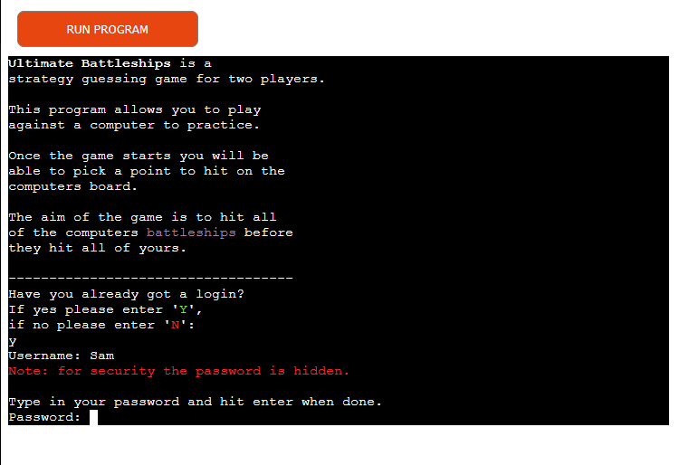
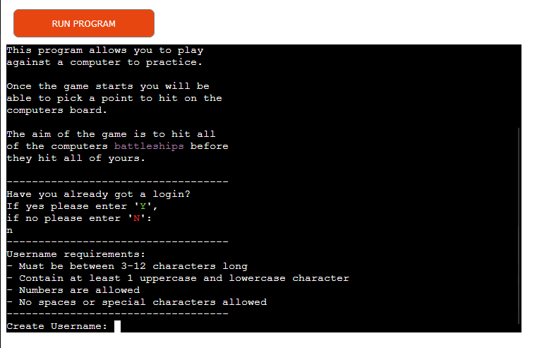
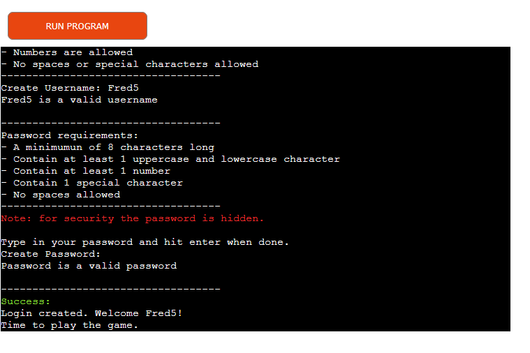
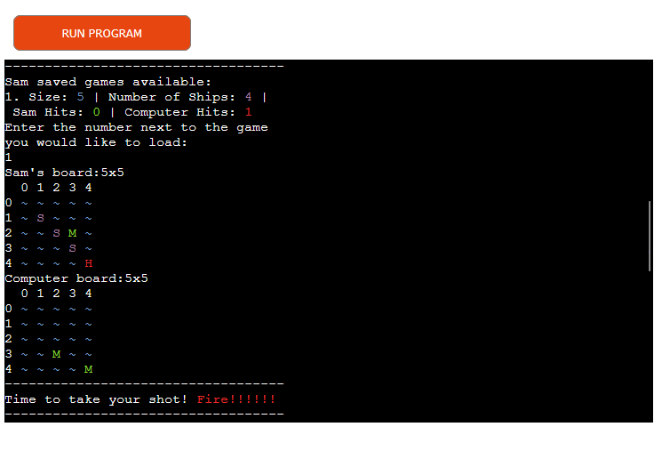
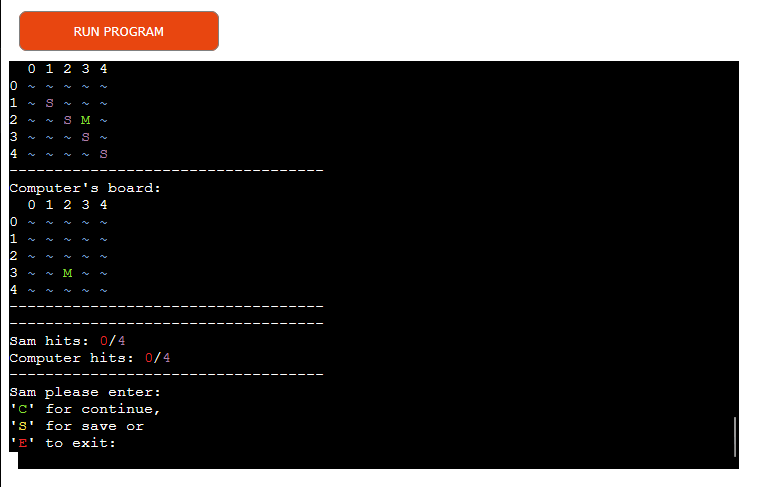
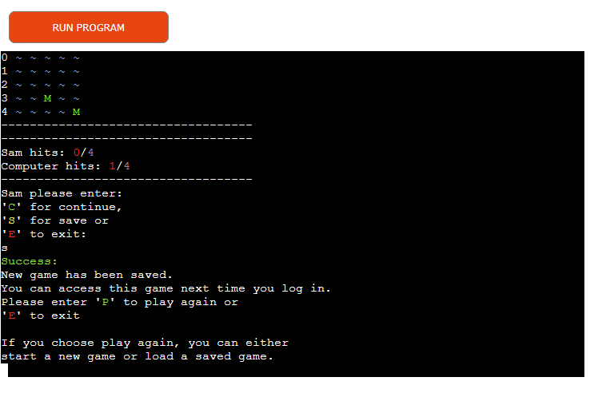
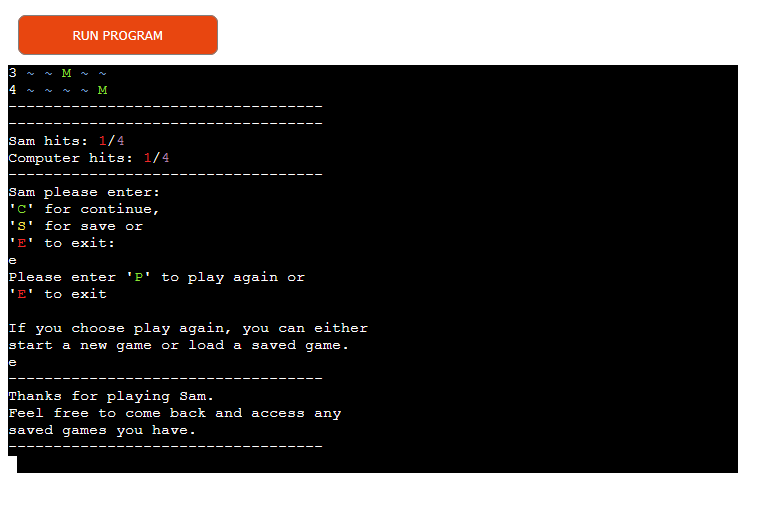
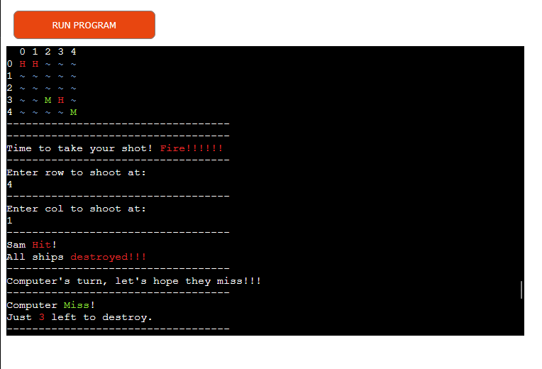
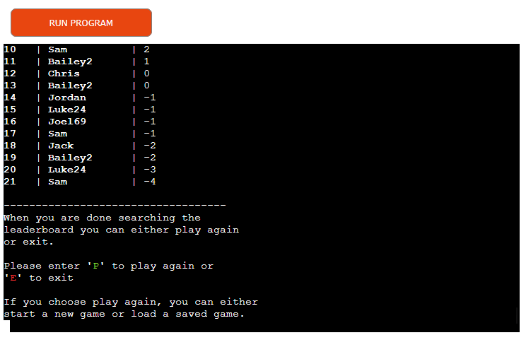
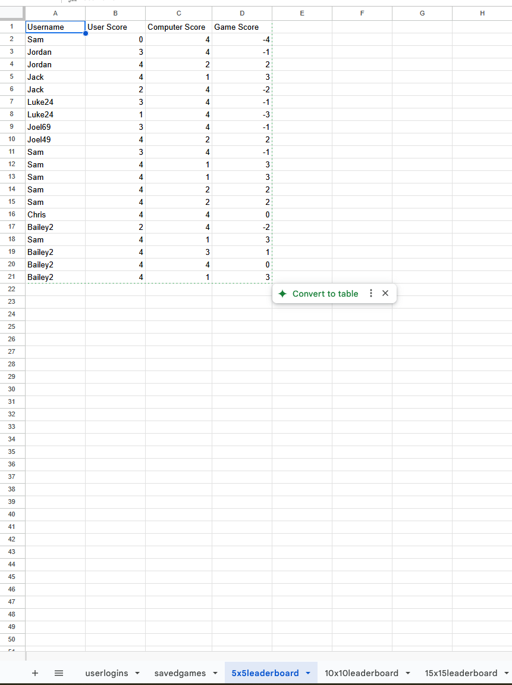

# Ultimate Battleships

**Ultimate Battleshis** is a Command Line Interface (CLI) game. The aim of this CLI is to provide users with a way of practicing a game of Battleships, which is a game that requires outwitting your opponent.

## User Stories & Wireframes

### User Stories

The decision to make this website is due to the user stories found [here](userstory.md).

### Logic Flow Chart

From the User Stories and wireframes a logic flow chart was mocked up to help know what the code needs to do, e.g. where error messages need to be, where loops need to be, when to end the program, etc. You can see the flow chart below.

Please note that in features and testing there are extra parts to the logic flow, which were thought of later in the project.

## Responsive Design

## Features

Below are the features for the website and at the end is listed any features that weren't able to be implemented but would be with more time.

### Existing Features

#### Welcome

- When starting the game the user is welcomed and the game is explained

#### Login Check

- User is asked if they have a login or not
- If user declares they have a login, they are invited to enter the login credentials
- If user declares they don't have a login, they are invited to create a username and password

#### Load Saved Games

- If user has any saved they games they are asked if they want to load a game or start a new game, if no games they are found it starts a new game
- If user wants to load a saved game they are shown a list of games they have saved and asked to choose one, game then continues with user taking a shot

#### Game

##### Board Selection

- When starting a new game they are invited to select a board size which determines the number of ships in the game

##### Place Ships

- User is then asked to place ships by choosing the row and then column until all ships are placed
- The computers board then has randomly placed ships
- The user is shown their board with placed ships and the computer's baord is shown but with ship placement hidden

##### Take Shots

- User is then asked to take a shot by choosing the row and then column
- User is informed if they hit, missed or have shot their already
  - If hit or missed they are told the amount of ships left to destroy
  - If they shot their already then they are invited to shoot again
- The computers board then has a random shot generated
- User is informed if the computer hit or missed and the amount of ships left to destroy
- The user is shown a key, their board and computer's board updated
  - The user's board has the ships, hits and misses the computer has done are shown
  - The computer's board has the hits and misses the user has done are shown
- If neither user nor computer have hit all the ships, they are then invited as to whether they want to continue, save, or exit that game
  - If continued they are shown the updated boards and then user takes shot again and the above repeats
  - If saved, the game is saved to the database and the user is asked to clarify if they want to play again or exit the whole program
  - If exit, the game is exited and the user is asked to clarify if they want to play again or exit the whole program
    - If user wants to play again they are asked if they want to load a saved game or start a new game, much like [Load Saved Games](#load-saved-games)
    - If user wants to exit the whole programme is exited
- If the user and/or the computer have hit all the ships, they are shown a message declaring a winner or tie, then a leaderboard is shown and the user is asked if they want to play again or exit the whole program
  - If the game was a loaded save, it is then deleted from the database

### Google Sheets Database

As mentioned in the above features, the user can save they create a username and password and they can save a game state or load a saved game.

Below I outline what the database has as features itself along with some screenshots to illustrate.

In the submission for the project I have shared a link for the assessors to see.

#### User Logins Sheet

- Username is stored as a plain string
- Password is stored encrypted/encoded using bcrypt
- bcrypt also decryptes/decodes the password so when a user logs in the password can be read properly as a string

#### Saved Games Sheet

- When a user starts a game it creates a Game ID using the datetime module to help identify the game when someone saves it and loads it, this helps with deleting a loaded game is completed
- Username is stored on this sheet to help identify if the user has any saved games or not when they log back in
- Board size for the game saved
- Number of ships for the game saved
- User board as a string
- Computer board as a string with the ship placement revealed so when game is loaded the programme can identify ship placements easily
- User hits, how many ships the user has hit on the computer's board
- Computer hits, how many ships the computer has hit on the user's board
- Available coordinates, what coordinates the computer hasn't shot at yet so when the game is loaded they are put into the tuple for the available coordinates within reset_coordinates function
  

#### Stored Leaderboard Sheets

- There are three worksheets for leaderboard storage, one for each size and the size selected helps determine which worksheet the game result is stored on for the leaderboard
- Username is stored so the leaderboard can include that in its list
- User score, how many ships the user has hit on the computer's board
- Computer score, how many ships the computer has hit on the user's board
- Game score, user score minus the computer score, this is the score that determines the position on the leaderboard and is the only one displayed on the leaderboard
- The user score and computer score is stored in case in the future the leaderboard function wants to show either of those as well as the game score

### Features Left to Implement

- Count the shots it took for the game to finish
- Only update the leaderboard if the users score is higher than their previous
- Show the user directly where they ended up on the leaderboard
- Have a search function on the leaderboard

## Testing

The app was tested in powershell 7 within VS Code and then deployed to Heroku and tested by other people who reported if there were any bugs or changes needed.

### Fixed Bugs From VS Code Testing

- In user_create the password and username weren't being stored in Google Sheets properly as there was no return within username_create and password_create
- Username creation was duplicating usernames in database due to structure of if, elif check_username function, therefore restuctured to put the check for username already in database first
- Board Creation was creating grid was to be 2D due to use of rows and cols, so coordinates were not being processed correctly, therefore changed the code to ensure the grid was being created as a 3D to allow proper use of coordinate selection
- When user input coordinates for ship placement they had placed in already it wasn't looping back to ask for the coordinates again, added in if, elif statement to ensured it looped properly
- When user input coordinates to shoot at have alreday been chosen it also wasn't looping, to loop had to amend the True and False returns in update_board
- Command line was running too fast so hard to read. Therefore, used time module to allow slower processing of the print statements
- After each shot the program is adding a hit to the user_ships_hits and computer_ships_hit if a ship has been hit previously, added ships_hit to update_board function and added code to play_game function to check for any "H" on the board
- Updated boards weren't printing to the terminal at all, updated play_game function to display_board in the correct space to allow it to be displayed
- Update_board function printing the statement incorrectly when a ship is hit, needed to reorder the structure below the elif statements
- Username not accessed by other scripts:
  - Username being fetched from database, the user_choice function keeps being called everytime fetch_username is being called, therefore set the username input as a global variable and created a function in user.py that returned the username which was then imported into game_logic.py
  - The above fix is not best practice, therefore adjusted user_login, user_creation and user_choice to properly return the correct information to allow the username to be accessed by other scripts
  - To also double check the login_credentials there was a while loop added to the main function in main.py to check that the username had returned properly
- Game state not saving when user requests to save it due to board not being JSON serializable, add function that converts the table into a string that is readable for google sheets
- Game did not exit after user input's save option, sys.exit was missing () at the end
- Unable to load previous game due to type error in board_size function, had to amend what was imported from battleships.py in main.py to allow use of Board class properly so the type could be located properly
- When logging in with a user that had no saved games it was still asking for user input to see if they wanted to load any saved games, had to create an instance of Load_Games as a variable and then call load_saved_games before the if, while and else statement, this then means if no saved game can be located with that username we go to play_game instead, if there is a saved game it asks if they want to load a saved game or not
- Password check function was misreading the re.search special character list, due to the positioning of symbols, had to reorder the symbols to ensure python read it correctly.
- Loaded in board was not looking user friendly, so used the " ".join to help make the board display nicely when loaded in.
- Leaderboard was displaying without a title or headings, so I added a leaders variable to lb_order that was appended too throughout to make the code neater and more manageable to read.
- When asking user to decide if they wanted to save, continue or exit the program and the user made an invalid input it kept looping through the print statement becuase the input request wasn't in the while loop
- Save function wasn't saving ship placement by the computer, so added a "," to ensure each item is saved to show the board as a list of strings, the user does not have access to the database file.
- When loading the saved game the boards weren't being converted as I needed to add the "," to the convert_board_to_grid function as the saved board was a list of strings
- When loading saved game states the program was displaying the ship placement, therefore needed to use the display_board function with the show_ships parameter correctly for the user board and computer board
- The computer's random shots sometimes shoot at the space it has already shot at to avoid this I added some variables to track and store where the computer had shot, so the random selection was not a duplicate shot.
- After adding colorama to various parts of the card we had some bugs:
  - dispaly_board function wouldn't work as the colour match wouldn't work. So had to change it from a hard equals to just look for an S no matter the colour.
  - update_game_status was printing the players name for both, because of a mistyped line by myself, fixed by changing it from {player} to Computer.
  - the save_game_state function wasn't accepting the inputs properly moved play_game function into game_logic.py at the end of the Game class, then renamed play_game function to full_game in main.py call the play_game function from game_logic.py
  - When checking shots due to the S and H now having a colour it the update_board function wasn't working out when a user or the computer hit a ship, so added in the colours to the if and elif statements.
  - The saved board was including the colorama ANSI codes in the saved boards, to remove this I added remove_colorama_codes() which compiles the various characters and numbers used in the ANSI codes and then removes them from the board before saving.
- No size set in full_game function for leaderboard_generation function to be called, therefore, added a size=None parameter in the full_game function.
- After cleaning up the code in the Game class and in main.py user_board and computer_board were accessing functions the wrong way, leading to not asking the user to place the ships and having blank boards. To fix the issue the requirement was to use self.player_board and self.pc_board variables in them instead of calling Board class.
- The user_hits and computer_hits in full_game and new_game were set to None rather than 0 as an integer.
- Saved data wasn't saving number of ships correctly due to passing None as the attribute and not 0 as a integer and ensure the total_ships was being used in the update and append_row part of the save_game_state function
- new_game function wasn't collecting the number of ships from selected game correctly, added total_ships=user.total_ships to the parameters of full_game within new_game.
- Validating password creation was not allowing passwords that were 8 characters long due to the >= 8, so removed the = signs from that if statement
- The available coordinates for the computer random shots wasn't resetting correctly, changed the if statement to have if not self.available_coordinates instead of if self.available_coordinates None
- Loaded games not listed correctly to choose from, had to ensure the games were being listed correctly by adding , _ to the self_games variable in access_saved_games to enable it to have the two parameters listed, but the second we did not care about
- Due to calling the wrong function from style.py the computer board wasn't placing ships properly, updated the function from style.py to be correct
- User hits and computer hits were being increased to the total number of ships due to an unneeded variable that changed the hits incorrectly player turn and computer turn
- Loaded in games weren't continuing, required adding if statements adn return statements into main.py load_games_check() and main() so it would continue from where it left off
- Loaded games led to computer's available coordinates to be reset, added available coordinates to saved games and have them load back in with the data as well by adding available_coordinates or self.available_coordinates variables to the correct functions and return the values properly and stringifying the coordinates. I also had to ensure reset_coordinates was making sure the function was only including water and ship places.
- After user chooses to play again, the programme declares no saved games available when there are saved games available. Added return statements to play again option function and include an if and else statement in the while true loop in the main function.

### Players Feedback and Fixes or Future Features
| Feedback | Solved (Y = Yes/N = No/FF = Future Feature) | Fix |
| ----- | ----- | ----- |
| Accept lowercase inputs when asking for letter inputs, e.g. Y and N | Y | add .strip().lower() or .strip().upper() to each of them |
| When a user continues the game, have the latest boards displayed for friendly user experience | Y | Use display_baord after continue request |
| Forgotten Password Function | FF | Would require account management and taking email addresses |
| Leaderboard not updating or showing if user plays a new game | Y | full_game() was setting size as none when playing a new game, amended full_game() to have a size value instead of None |
| iPhone users report issues with entering inputs | N | Due to how Heroku's CLI works this project without a Frontend won't work on mobile, to enable to work would have to build a frontend part to the game using HTML, CSS and JavaScript |
| Shorten lines for better display on mobile | Y | Added \n at appropriate points to display on a mobile device |
| Leaderboard layout not properly readable for users | Y | Display only the Game Score and separate out the columns appropriately so they match up |
| Password creation and when logging in to be blank | Y | Use getpass module to do this |

### Unfixed Bugs

- None

### Logic Flow Table

I have made a logic flow table to monitor the testing of the features.
Due to the loops depending on the user input the steps can be labelled with an A, B, C, etc to indicate which step it has moved too.

You can access it [here](logicflow.md)

### Validator Testing

- PEP8

## Deployment

The app deployed via Heroku [here](https://ultimate-battleships-sb-dc59e658fbd6.herokuapp.com/) following the below steps

### Version Notes
Before going to Heroku make sure the .python-version is at the correct version.

You can check this by:
1. Typing python --version or python3 --version in your terminal
2. Update the file .python-version to the correct version
   1. The python version for this project as of 30/04/2025 is 3.13.3

Important note, before upgrading to latest python version, check all the dependencies and modules are accepted by that version.

Once you have the correct version of python installed and noted, you then need to install the correct versions of the dependencies and update requirements.txt.

To do the above follow below:
1. Install the correct versions of the dependencies and modules
2. For the correct dependencies use pip install "dependency/module name" or pip3 install "dependency/module name"
   1. If the dependency or module is an older version add =="version"
3. Then type pip freeze > requirements.txt or pip3 freeze > requirements.txt to update requirements.txt

### Creating the Heroku App
To create the app Heroku was used. In Heroku two buildpacks were needed and were accessed from the _Settings_ tab in Heroku. After adding the individual buildpacks the settings were saved. The two packs used and their ordering is as follows:

1. `heroku/python`
2. `heroku/nodejs`

Then 2 config vars were needed and were created by going to _Settings_ tab in Heroku and scrolling down to _Config Var_ section. After each individual config var was added the settings were saved Then the following config vars were created: 

1. One called `PORT` and set to `8000` was created
2. CREDS

Then the GitHub repository was connected by following the below steps:

1. Go to _Deploy_ section
2. Select GitHub as the deployment method
3. Confirm we wanted to connect GitHub
4. Then search for the ultimate_battleships repository and connected it
5. Then in Manual deploy, select the main branch and click Deploy Branch, this should then deploy the app

## Cloning

This section describes how other software developers can clone the code to edit it elsewhere

- To clone the code so you can edit it yourself please follow the below:
  PLEASE NOTE THIS IS FOR WINDOWS COMMAND LINE
  - In the GitHub repository click the dropdown for '<> code'
  - Ensure you are on 'local' and have 'https' selected, then copy the URL by clicking the symbol next to the URL box
  - Once copied in the search bar on your taskbar type in 'cmd' and open 'Command Prompt' or 'Comman Line'
  - In command line type 'git clone' and paste the url next to it
  - In file explorer locate 'This PC' down the side, then 'local disk' (usually the :C drive), then 'users', then your user, then find the folder called 'ultimate_battleships'
  - You now have access to all the code and files locally
  - If you want to edit the code, please ensure you creat a new branch in the software you are using enabling us to potentially see the edits you have done before uploading them to the original GitHub repository
  - To create a new branch that depends on the software you are using, please google how to do this for your software

If you aren't on windows please google how to get a GitHub repository stored locally on your OS

## Credits

Below are my credits for where I got inspiration for some of the code.

### Code

- This video helped me understand regex, [regex tutorial](https://www.youtube.com/watch?v=F6FW_NMtvNY)
- This article helped me understand how to import other script files as modules, [import python script as a module guide](https://csatlas.com/python-import-file-module/)
- This video helped me understand how to use user login verification and creation in python, [User Login Guide in Python](https://www.youtube.com/watch?v=9OjD_HjV03E)
- Below are the various articles I used to help form the battleships game:
  - [Battleship Game Guide 1](https://bigmonty12.github.io/battleship)
  - [Battleship Game Guide 2](https://www.pyshine.com/Make-a-battleship-game/)
  - [Battleship Game Guide 3](https://llego.dev/posts/how-code-simple-battleship-game-python/)
- Using the Love Sandwiches project I learnt how to use Google APIs and therefore used the steps to be able to use Google Sheets as my database
- Code Institutes Battleships example introduced me to random and randint
- Various stack overflow posts introduced me to sys and time module and how to use them both, there were too many to remember which ones were truly helpful
- My mentor mentioned to me about colorama module and this video helped me understand it, [Colorama Guide](https://www.youtube.com/watch?v=u51Zjlnui4Y)
- My mentor also intorduced me to using staticmethod for colorama functions
- This post on stack overflow helped me grasp the idea of how to strip ANSI codes from the saved baords, [ANSI Codes Guide](https://superuser.com/questions/380772/removing-ansi-color-codes-from-text-stream/1388860#1388860)
- I used this guide from [Geek for Geeks - Convert List to String](https://www.geeksforgeeks.org/python-program-to-convert-a-list-to-string/?utm_source=chatgpt.com) to help me do the following:
  - When creating the boards for the game initially to take the string and make it into a 2D grid
  - When converting the 2D grids into a string for the Google Sheets file
  - When converting the saved string back into a 2D grid when a user loads a saved game
- Chatting with my mentor and reading this [Stack Overflow - Maximum Length of Function](https://softwareengineering.stackexchange.com/questions/27798/what-is-proven-as-a-good-maximum-length-of-a-function) I worked out that good practice is to have your functions as small as necessary, e.g. can you read a function top to bottom wihtout scrolling. So using this idea I refactored a lot of my code and using classes and functions as modules in different scripts. There are times where this isn't possibly due to making the parameters of a function readable.
- Using datetime module to create a Game ID for games I followed these two: [Datetime document](https://docs.python.org/3/library/datetime.html), [Datetime guide](https://www.geeksforgeeks.org/python-datetime-module/)
- To find out how to delete an individual row I used the below guides for it:
  - [Stack Overflow delete_row()](https://stackoverflow.com/questions/14625617/how-to-delete-remove-row-from-the-google-spreadsheet-using-gspread-lib-in-pytho)
  - [Gspread 5.1 Documentation](https://docs.gspread.org/en/v5.1.1/api.html?highlight=delete_row#gspread.worksheet.Worksheet.delete_row)
  - [Gspread 6 Documentation](https://docs.gspread.org/en/v6.0.0/api/models/worksheet.html#gspread.worksheet.Worksheet.delete_rows)
    - Looking at the stack overflow post I discovered delete_row but it wasn't working
    - So looked at the gspread 5.1 and saw there was delete_row and delete_rows functions
    - After checking my requirements.txt I noticed I was using gspread 6.2
    - So looked at gspread 6 documentation and saw delete_row had been removed, but delete_rows was still available
- To help understand how to use getpass module I used these two links: [Getpass document](https://docs.python.org/3/library/getpass.html), [Getpass Guide](https://www.geeksforgeeks.org/getpass-and-getuser-in-python-password-without-echo/)